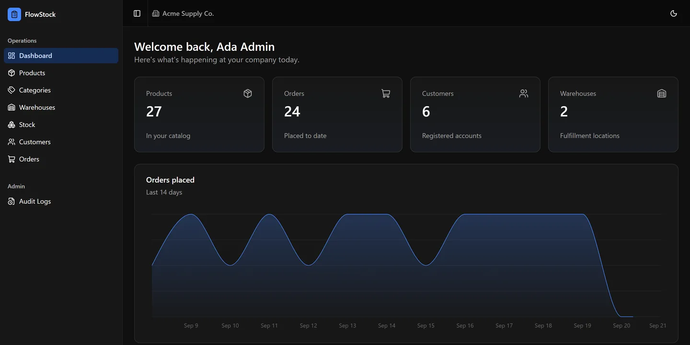
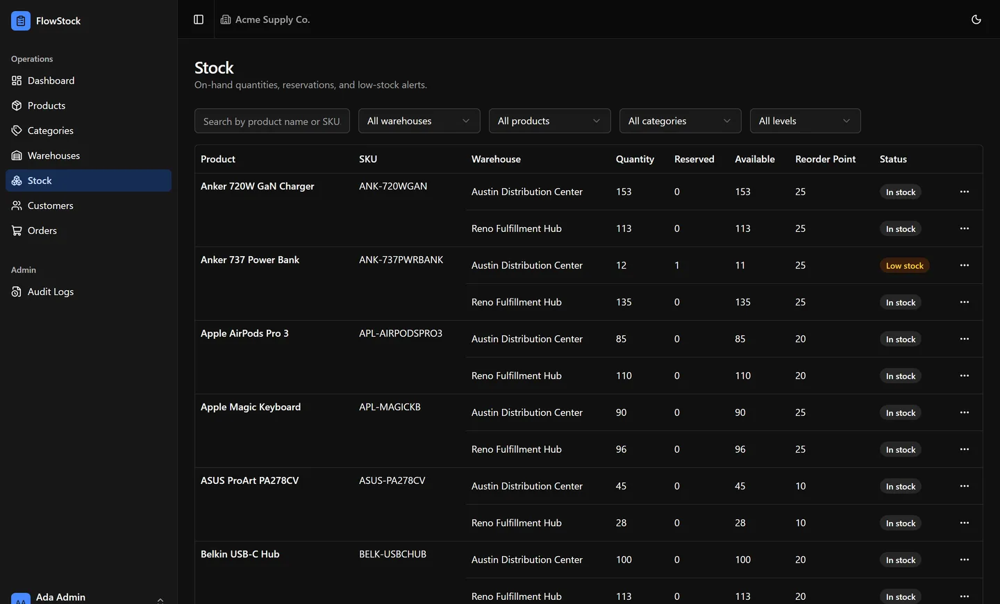
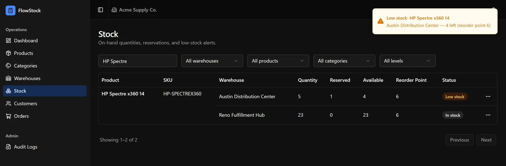
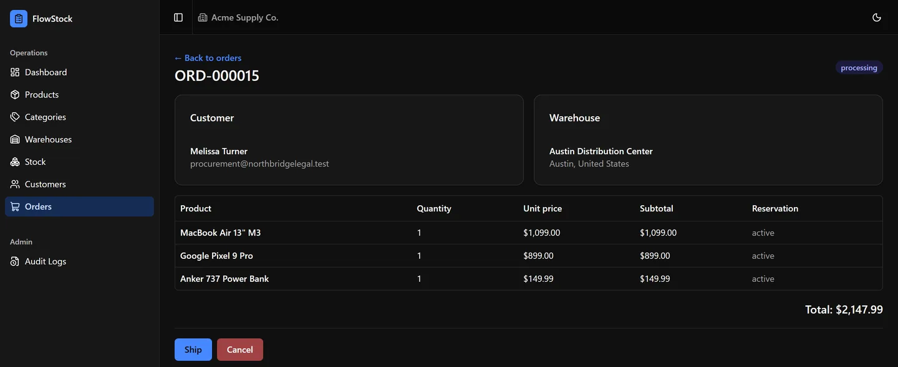

# FlowStock

A multi-tenant inventory & order management platform — a portfolio project
built to demonstrate production-quality full-stack engineering: a Laravel
API with real concurrency safety and tenant isolation, and a React admin
dashboard with live updates, not a CRUD toy.

[](https://github.com/amanilabs/flowstock/actions/workflows/ci.yml)
[](LICENSE)

## Screenshots



*Dashboard — real seeded data for Acme Supply Co.: catalog/order/customer/warehouse counts and a 14-day order-volume chart.*



*Stock — cross-product, cross-warehouse inventory, grouped by product, with a naturally-occurring low-stock row alongside normal ones.*



*Real-time alert — a genuine stock adjustment through the UI crossed a reorder point; Reverb broadcast it over a private channel and this toast appeared with no page refresh.*



*Order detail — a `processing` order with active stock reservations per line item and its next valid lifecycle actions.*

## Highlights

- **Real concurrency safety, proven not assumed** — stock movements use
  PostgreSQL row locking; a dedicated two-connection test proves a second
  transaction actually blocks, rather than trusting application-level
  logic alone.
- **Multi-tenant by construction** — shared database, automatic tenant
  scoping on every query via a global Eloquent scope, RBAC
  (Admin/Manager/Staff) scoped per tenant with `spatie/laravel-permission`.
- **Live low-stock alerts** — Laravel Reverb broadcasts over private,
  Sanctum-authenticated per-user channels the moment a stock movement
  crosses a warehouse's reorder point; the dashboard shows a toast with no
  page refresh, alongside the existing queued email.
- **130 tests, zero SQLite** — the full suite runs against a real
  PostgreSQL database, locally and in GitHub Actions CI, because SQLite
  can't validate the `CHECK` constraints and row locking this app relies
  on.
- **Event-driven order lifecycle** — state-machine-driven order
  transitions, queued notifications over Redis, and audit logging with
  attribute-level diffs on every write.
- **Safe by default** — API errors never leak a stack trace or file path
  regardless of debug mode; tenant and permission checks fail closed.
- **Profiled, not just built** — measured real request timings and query
  counts to find and fix an N+1 in the inventory listing, an
  over-invalidating React Query mutation, and a Docker/opcache
  misconfiguration that was adding ~1.7s to every local request.

## Architecture

```
frontend/  React 19 + TypeScript SPA (Vite) ── talks to ──▶  /api/v1  (Sanctum bearer tokens)
                                                                  │
                                                          Laravel 12 API
                                                                  │
                        ┌─────────────────────┬───────────────────┴──────────────┬──────────────┐
                        ▼                     ▼                                   ▼              ▼
                  PostgreSQL 16          Redis 7                            Laravel Reverb   queue worker
             (tenant-scoped tables,   (cache + queue)                    (WebSocket, private   (async jobs:
              row-locked stock)                                          per-user channels)   emails, listeners)
```

- **Multi-tenancy**: a shared database with a global Eloquent scope
  (`TenantScope` + `BelongsToTenant` trait) applied to every tenant-owned
  model — no per-query opt-in, isolation is the default.
- **RBAC**: `spatie/laravel-permission`'s teams feature, with `tenant_id`
  as the team key, so the same Admin/Manager/Staff roles exist
  independently per tenant.
- **Order lifecycle**: `OrderService` drives a real state machine
  (pending → confirmed → processing → shipped → delivered, with
  cancel/refund branches), firing domain events that queued listeners
  turn into emails and audit trail entries.
- **Stock integrity**: `StockService` wraps every quantity change in a
  row-locked transaction and fires `LowStockDetected` exactly once per
  threshold-crossing movement (not once per request).
- **Caching**: tenant-scoped list endpoints are cached in Redis with tags
  (`tenant:{id}:{resource}`) and a short TTL as a safety net — real
  invalidation is an explicit tag flush on every write, not just
  time-based expiry.

## Tech stack

**Backend** — Laravel 12 · PHP 8.4-FPM · PostgreSQL 16 · Redis 7 ·
Laravel Reverb (WebSockets) · Sanctum · `spatie/laravel-permission` ·
`spatie/laravel-activitylog` · `dedoc/scramble` (OpenAPI) · Pest · Pint ·
Docker Compose

**Frontend** — React 19 · TypeScript · Vite · Tailwind CSS v4 · shadcn/ui
(Radix) · React Router · TanStack Query · React Hook Form + Zod ·
Recharts · Laravel Echo + Pusher-js (Reverb client)

## API & docs

Interactive, code-generated API docs: **`/docs/api`** (raw OpenAPI spec at
`/docs/api.json`). All 40 routes live under `/api/v1`, Sanctum-authenticated
and permission-gated per route.

| Group | Endpoints |
|---|---|
| Auth | login, logout |
| Products / Categories / Warehouses | full CRUD |
| Stock | cross-product inventory listing, per-product view, adjust, movement history |
| Orders | create, view, confirm → process → ship → deliver, cancel, refund |
| Customers | full CRUD |
| Audit logs | read-only, Admin only |
| Broadcasting | Sanctum-authorized Reverb channel auth |

## Demo accounts

No self-service registration. Seed three fully isolated demo tenants —
products, stock across two warehouses, customers, and 24 orders each
spanning every lifecycle status (so the dashboard chart and every UI
state have real data):

```bash
docker compose exec app php artisan db:seed --class=DemoDataSeeder
```

| Tenant | Admin | Manager | Staff |
|---|---|---|---|
| Acme Supply Co. | `admin@acme.test` | `manager@acme.test` | `staff@acme.test` |
| Northstar Office Supplies | `admin@northstar.test` | `manager@northstar.test` | `staff@northstar.test` |
| Urban Retail GmbH | `admin@urbanretail.test` | `manager@urbanretail.test` | `staff@urbanretail.test` |

Password for every account: `password`. Safe to rerun — it resets its own
tenants each time.

## Local setup

**Backend**

```bash
cp .env.example .env
docker compose up -d
docker compose exec app composer install
docker compose exec app php artisan key:generate
docker compose exec app php artisan migrate
docker compose exec app php artisan db:seed --class=DemoDataSeeder
```

App: `http://localhost:8081` · API docs: `http://localhost:8081/docs/api`

Backend PHP code is bind-mounted for live editing, but the dev image runs
with `opcache.validate_timestamps=0` for consistent local request speed —
after editing backend PHP, run `docker compose restart app` (fast, no
rebuild) to pick up the change.

**Frontend**

```bash
cd frontend
cp .env.example .env
npm install
npm run dev
```

Runs at `http://localhost:5173`, talking to the API at `VITE_API_URL`.
See [`frontend/README.md`](frontend/README.md) for frontend architecture
notes.

To create a tenant/admin manually instead of seeding demo data, use
Tinker (`docker compose exec app php artisan tinker`):

```php
$tenant = App\Models\Tenant::create(['name' => 'Acme Inc', 'slug' => 'acme-inc', 'status' => 'active']);
$user = App\Models\User::create(['tenant_id' => $tenant->id, 'name' => 'Admin', 'email' => 'admin@acme.test', 'password' => Hash::make('password')]);
app(Spatie\Permission\PermissionRegistrar::class)->setPermissionsTeamId($tenant->id);
$user->assignRole('Admin');
```

## Testing

```bash
docker compose exec app php artisan test    # real Postgres, not SQLite
docker compose exec app ./vendor/bin/pint --test
```

130 tests / 437 assertions across `tests/Feature` (products, orders,
stock, tenancy, warehouses, customers, RBAC, audit logs, auth, rate
limiting, caching, error formatting), `tests/Unit/Services` (order price
math, order transition matrix, stock locking), and `tests/Concurrency`
(a real two-Postgres-connection test proving row locks actually block).
`phpunit.xml` pins a real `flowstock_test` PostgreSQL database — never
SQLite.

## Production / Docker

```bash
docker compose -f docker-compose.prod.yml up -d --build
```

The prod stack uses a separate, hardened multi-stage image
(`docker/php/Dockerfile.prod`): dependencies are installed and the
autoloader optimized (`--no-dev --classmap-authoritative`) in a build
stage, then only the built application is copied into a minimal
`php:8.4-fpm` runtime — no bind mount, no dev tooling, code baked into
the image. Dev and prod use separate `php.ini`/nginx configs tuned for
their own trade-offs (dev favors fast local requests; prod favors a
clean, reproducible build). `app`, `queue-worker`, `scheduler`, and
`reverb` all share that one image, differing only in their `command:` —
`docker-compose.prod.yml`'s `reverb` service exposes the WebSocket port
directly (`6001`, same as dev), so real-time low-stock alerts work the
same way in production. Copy `.env.production.example` to `.env` first
and fill in real secrets — `REVERB_APP_ID`/`KEY`/`SECRET` are left blank
there deliberately, don't reuse the demo repo's dev values.

## CI

GitHub Actions (`.github/workflows/ci.yml`) runs on every push/PR to
`main`, against real Postgres 16 + Redis 7 service containers:

- **test** — full Pest suite
- **lint** — `pint --test`
- **audit** — `composer audit` for known vulnerable dependencies

## Roadmap / known gaps

- CI covers the backend only — no frontend build/typecheck/lint job yet.
- No demo GIF yet — screenshots above are static.

## License

[MIT](LICENSE)
